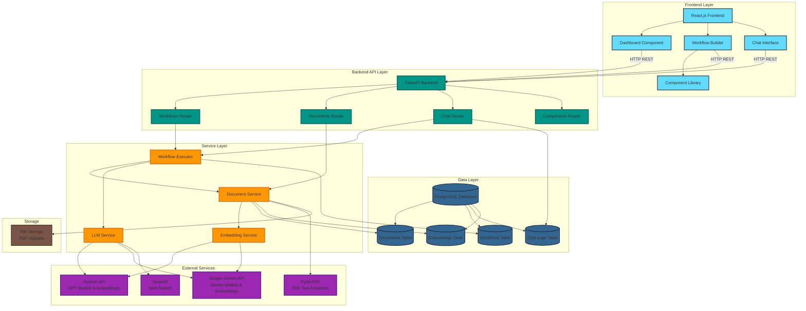
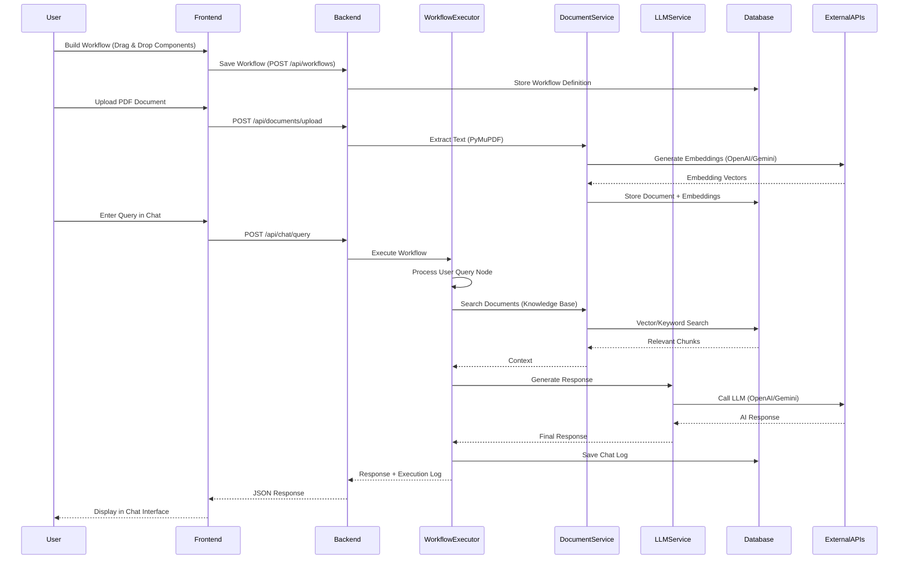
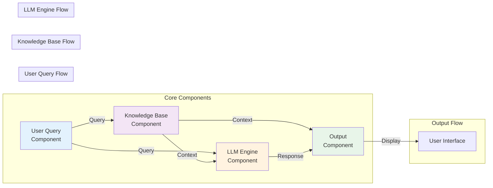
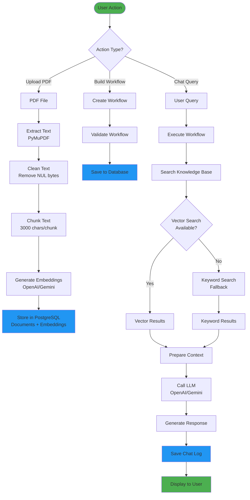
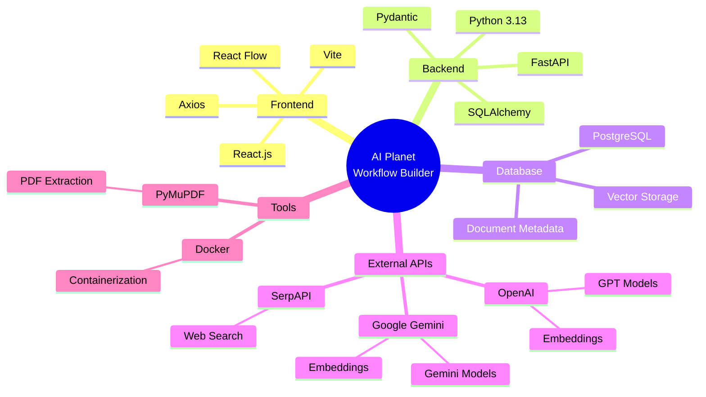
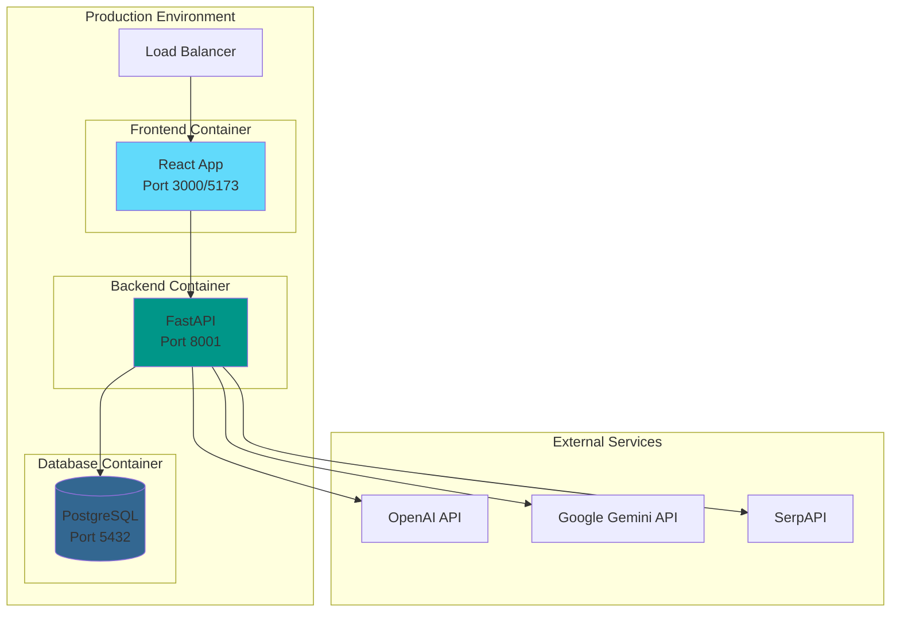

# AI Planet - No-Code Workflow Builder Architecture

## System Architecture Diagram

## Workflow Execution Flow

## Component Architecture

## Data Flow Diagram

## Technology Stack Overview

---

## Architecture Components Description

### **Frontend Layer (React.js)**
- **Dashboard**: Displays saved workflows/stacks
- **Workflow Builder**: Visual canvas for building workflows using React Flow
- **Chat Interface**: Interactive chat for querying workflows
- **Component Library**: Sidebar with draggable components

### **Backend Layer (FastAPI)**
- **Workflows Router**: CRUD operations for workflows
- **Documents Router**: PDF upload and document management
- **Chat Router**: Query execution and chat history
- **Components Router**: Component type definitions

### **Service Layer**
- **Workflow Executor**: Orchestrates workflow execution based on node connections
- **Document Service**: Handles PDF processing, text extraction, and search
- **Embedding Service**: Generates embeddings using OpenAI/Gemini
- **LLM Service**: Manages LLM interactions with fallback mechanisms

### **Data Layer (PostgreSQL)**
- **Documents Table**: Stores document metadata and content
- **Workflows Table**: Stores workflow definitions (nodes, edges)
- **Chat Logs Table**: Stores conversation history
- **Embeddings Table**: Stores vector embeddings for semantic search

### **External Services**
- **OpenAI API**: GPT models and text embeddings
- **Google Gemini API**: Gemini models and embeddings
- **SerpAPI**: Web search functionality
- **PyMuPDF**: PDF text extraction

---

## Key Features

1. **No-Code Workflow Builder**: Visual drag-and-drop interface
2. **Intelligent Document Processing**: PDF extraction with embedding generation
3. **Multi-LLM Support**: OpenAI and Google Gemini with automatic fallback
4. **Fail-Safe Search**: Vector search with keyword fallback
5. **Real-time Execution Logs**: Detailed workflow execution tracking
6. **Chat History Persistence**: All conversations saved in database

---

## Deployment Architecture

---

*This architecture diagram represents the complete system design of the AI Planet No-Code Workflow Builder application.*
